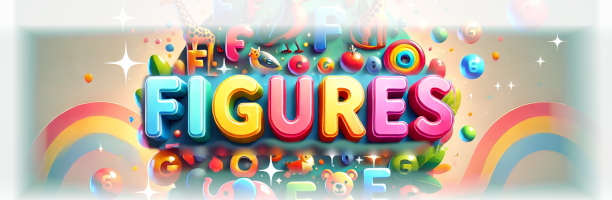

# sesolibre-figures
A game to eliminate figures inspired on gems style games.

The game has options 
- Vertical and horizontal mode, the horizontal mode works from right to left.
- It has 4 different set of figures
- It can enable and disable the sound.
- It can be played with unlimited moves or only 20
- The score is displayed at the end

It uses React

Used Claude.ai

Some images and audio come from:
Animals de Freepik

Numbers Image by [Jaquelin Lassen](https://pixabay.com/users/jackielin1-19315469/?utm_source=link-attribution&utm_medium=referral&utm_campaign=image&utm_content=7675885) from Pixabay 

Letters Image by [Suxu](https://pixabay.com/users/suxu-269261/?utm_source=link-attribution&utm_medium=referral&utm_campaign=image&utm_content=1168050) from Pixabay 

Katakana Wikimedia https://commons.wikimedia.org/wiki/File:Katakana_origine.svg

Sound Pixabay Soundeffects https://pixabay.com/sound-effects

